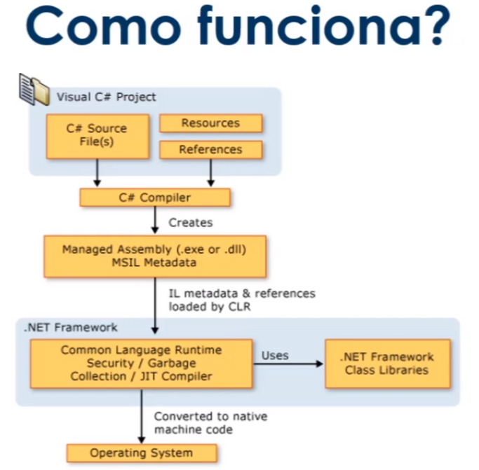

# C# .NET

C# é uma linguagem elegante, orientado a objeto e fortemente tipada, a sua sintaxe é similar do c,c++ ou JAVA.

Suporta os conceitos de encapsulamento, Herança e Polimorfismo (OO).

Os programas em C# sao executados no .NET, que inclui:

- CLR(Common Language Runtime).
- Conjunto unificado de bibliotecas de classes

O compilador atual é o **Roslyn**

## Como funciona

O código fonte escrito em c# é compilado em uma linguagem intermediária (IL)

O código e os recursos de IL são armazenados no disco em um arquivo executável chamado **assembly, geralmente com uma extensão .exe ou dll**.

Quando o programa C# é executado, o assembly é carregado no CLR. Em seguida o CLR executara a aplicação jus in time (JIT) para converter o código IL em instruções de maquina nativas.

Outros servicos do CLR:

- Garbage Collector
- Exception Handler
- Resources Manager

Alem dos serviços de tempo de execução, o .NET também inclui uma extensa biblioteca com milhares de classes que fornecem uma ampla variedade de funcionalidades uteis, desde entrada e saída de arquivos, manipulação de cadeias de caracteres, analise XML, etc

## Estrutura de programa

Os principais conceitos organizacionais em c#:

- programas
- namespaces
- tipos
- membros
- assemblies

Programas constituem em um ou mais arquivos. 

Os programas declaram tipos, que contem membros e podem ser organizados em namespaces.

Classes e interfaces são exemplos de tipos.

Campos, métodos, propriedades e eventos são exemplo de membros

Quando os programas C# são compilados, eles são fisicamente empacotados em assemblies.

Os assemblies geralmente tem a extensão de arquivo .exe ou .dll, dependendo se são aplicações ou bibliotecas.

## Tipos e variáveis

Variáveis de tipos de valor contem diretamente seus dados.

As variáveis tem sua própria copia dos dados e não é possível que as operações afetem outra variável (exceto no caso das variáveis de parâmetro ref e out)

- Numéricos → sbyte, short, int, long, byte, ushort, unit, ulong
- Caracteres Unicode → char
- Pontos flutuantes → float, double, decimal
- Booleano → bool
- Outros → enum, struct e tipos nullable(ex: int?)

Variáveis de tipo de referência armazenam referência a seus dados

É possível que duas variáveis façam referência ao mesmo objeto e, portanto, que operações em uma variável afetem o objeto referenciado pela outra variável.

### tipos de referência

- Tipos Classe → class, object, string
- Tipos Arrays → int[], int[,], etc...
- interface, delegate

## Instruções

Acoes de um programa são expressas usando instruções

{

um bloco permite que varias instruções sejam escritas em contextos

}

- Declaracao de variaveis e constantes locais
- if
- switch
- while
- do
- for
- foreach

Instrucoes auxiliares → 

- break
- continue
- return
- throw
- try .. catch .. finally
- using

## Arrays

Um array é uma estrutura de dados que contem um numero x de elementos, todos do mesmo tipo, que são acessados através de índices computados.

Arrays são tipos de referencias e a declaração de uma variável array simplesmente reserva espaço para uma referencia de uma instancia de array.

Ao criar um array é especificado o tamanho da nova instancia, que é fixo durante todo o tempo de vida da instancia.

Os índices dos elementos de um array variam de 0 a comprimento do array -1

## Classes e Objetos

Classes são os tipos mais fundamentais de C#.

Uma classe é uma estrutura de dados que combina **estado(campos) e ações(métodos).**

Os objetos são instancia de uma classe. As classes suportam herança e polimorfismo, mecanismos pelos  quais as classes derivadas podem estender e especializar as classes base.

Instância de classes são criados usando o operador **new**, que aloca memória para uma nova instância, chama um construtor para inicializar a instância e retornar uma referência a instância.

Os membros de uma classe podem ser estáticos ou membros da instância

Membros estáticos pertencem a classe e membros de instância pertencem ao objeto.

Constantes, variáveis, métodos, propriedades, Construtores, etc...

Cada membro de uma classe tem uma acessibilidade associada, que controla as regiões do texto do programa que podem acessar o membro.

EX → 

- public → todos tem acesso.
- protected → Apenas as classes que herdam da classe base tem acesso.
- internal → só é acessado dentro do **assemble(Namespace)** que ele faz parte.
- private → só pode ser acessado pela própria classe

## Herança

Uma declaração de classe pode especificar uma classe base, herdando os membros public, internal e protected da classe base.

Omitir uma especificação de classe base é o mesmo que derivar do tipo object.

OBS → Uma classe pode herdar de apenas uma classe ou de varias interfaces.

## Métodos

Um método é um membro que implementa uma computação ou ação que pode ser executada por um objeto ou classe.

Os métodos podem ter uma lista de parâmetros, que representam valores ou referências de variáveis passados para o método, e um tipo de retorno, que especifica o tipo do valor calculado e retornado pelo método.

### métodos estáticos

- São declarados com o modificador "static".
- Não são visualizados através de uma instância da classe.
- São acessados diretamente pela classe.
- Pertencem a classe e não ao objeto.

## Structs

Como as classes, as **structs** são estruturas de dados que podem conter membros de dados e membros de ação, mas, diferentemente das classes, as **structs** são tipos de valor não requerem alocação de heap(Local da memória que fica alocado as variáveis).

Uma variável de um tipo de **struct** armazena diretamente os dados da estrutura, enquanto uma variável de um tipo de classe armazena uma referência a um objeto alocado na memória.

Structs não aceitam herança determinada pelo desenvolvedor.

São úteis para pequenas estruturas de dados que possuem semântica de valor: números complexos, pontos em um sistema de coordenadas ou pares de chave-valor em um dicionario são bons exemplos de utilização.

O uso de structs em vez de classes para pequenas estruturas de dados pode  fazer uma grande diferença no número de alocações de memória.

Construtores de structs são chamados com o mesmo operador new, semelhante a um construtor de classe, mas em vez de alocar dinamicamente um objeto no heap gerenciado e retornar uma referência a ele, um construtor struct simplesmente retorna o próprio valor struct(normalmente em um local temporário na stack), e esse valor é copiado conforme necessário

## Interfaces

Uma interface define um contrato que pode ser implementado por classes e structs.

Uma interface pode conter métodos, propriedades, eventos e indexadores.

Uma interface não fornece implementações dos membros que define - apenas suas "assinaturas".

As interfaces podem empregar herança múltiplas.

## Enums

Um enum é um tipo de valor distinto com um conjunto de constantes nomeados.

Você define enumerações quando precisa definir um tipo que pode ter um conjunto de valores discretos. Eles usam um dos tipos de valor integral como armazenamento subjacente. Eles fornecem significado semântico aos valores discretos.
