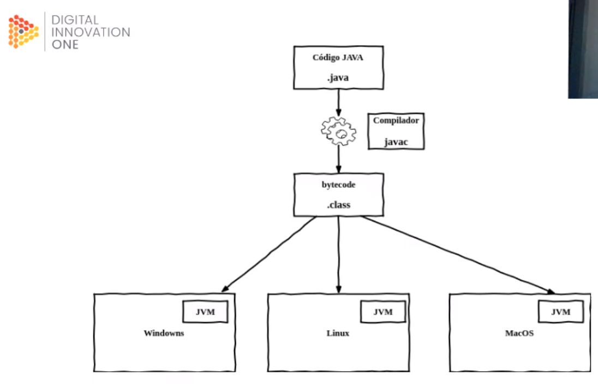
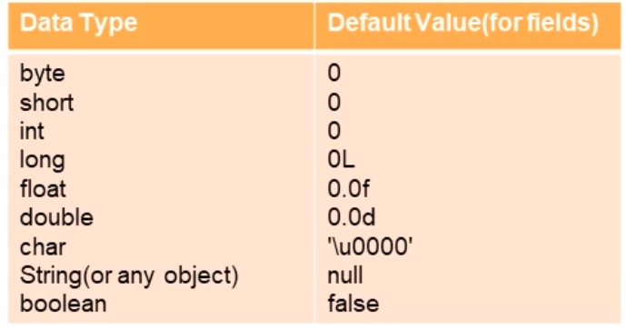

# Java

Instalacao java 10: 

$ sudo add-apt-repository ppa:linuxuprising/java

$ sudo apt update

$ sudo apt install oracle-java10-installer

$ java --version

## Ferramentas de Build

### Gradle

- usa linguagem de programação groovy

### Maven

- Legados do ANT
- Baseado em XML

### Wrappers

- garante a mesma versão para todos os desenvolvedores

Maven e Gradle são ferramentas de Build.

## Iniciando projeto

[start.spring.io](http://start.spring.io) → escolhe qual tipo de ferramenta de build e a versao do spring

Define o GROUP, que é o domínio da empresa em que se faz o projeto, inseri-se o link na ordem inversa.

seleciona a versão do java

Adiciona uma descrição

Se preciso adiciona as dependências.

## O que é java

Java é uma linguagem de programação computacional, criada em 1995 pela Sun Microsystems. Anos depois foi adquirida pela oracle.

Java é uma linguagem que é compilada para bytecode que é interpretado por uma maquina virtual.

### O que é compilador

Um compilador é um programa que, a partir de um código fonte, cria um programa semanticamente equivalente, porem escrito em outra linguagem,  **→código objeto←**. Um compilador traduz um programa de uma linguagem textual para uma linguagem de maquina, especifica para um processador e sistema operacional.

### O que é uma JVM

Uma VM ou maquina virtual, é um software que simula uma maquina física e consegue executar vários programas, gerenciar processos, memoria e arquivos. 

A JVM é uma maquina virtual que executa programas JAVA, Executando os bytecodes em linguagem de maquina para cada sistema operacional.

Em linguagens compiladas, esses sistemas sao executados diretamente para um sistema operacional especifico.

Com o java, é compilado pela JVM que gera um bytecode e não diretamente pelo sistema operacional, porem existe um JVM para cada Sistema Operacional.

### O que é JRE?

JRE significa Java Runtime Environment, ou ambiente de execução java, é composta pela **JVM,** bibliotecas e APIs da linguagem java e outros componentes para suporte da plataforma java.

### O que é JDK?

Java Development Kit(JDK), é um conjunto de utilitarios que permitem criar softwares para a plataforma Java. É composto pelo compilador JAVA, bibliotecas da linguagem, ferramentas e a JRE.

### O que é JSE?

Java Standart Edition, é a distribuição minima da plataforma de desenvolvimento de aplicações java.

### O que é JEE?

Java Enterprise Edidtion, é uma extensão do JSE que possui suporte a desenvolvimento de sistemas corporativos.

O JEE alem da estrutura minima, ele possui partes da infraestrutura de aplicações, como acesso a banco de dados, mensageira, serviços web, parser de arquivos e outras.

### O que é Jakarta EE?

Ele é a JavaEE mas de posse da Eclipse Foundation, pela falta de disponibilidade de nome ela nomeos de JakartaEE.

## Classes

Todo programa java roda em cima de uma classe.

As classes começão com aletra maiúscula, se la tem nome composto cada nome tem que ter a primeira letra maiúscula.

O método principal para executar um programa é o **public static void main(String[] args)**

### Atributos

Uma classe pode possuir atributos que podem ser publicas, privadas, restritas e protegidas.

### Construtores

### Métodos

Os métodos são funções que fazem alguma ação, por exemplo, os construtores são métodos que servem para instanciar uma classe vazia ou preenchida.

### Tipos

- primitivos
    
    eles possuem algumas características, não pode ser nulo e possuem valores default
    
    os tipos primitivos são divididos em alguns grupos,
    
    
    
    - byte → limite de valor 127 e -128 que equivalem a 8 bits
    - char → valor máximo de 16 bits, possuindo apenas um carácter
    - short → valor máximo de 16 bits, e armazena números
    - int → valor máximo de 32 bits
    - long → valor máximo de 64 bits, uma característica  é colocar um **L** no final para avisar que é um long
    - float → Armazena números flutuantes de 32 bits = 65.0f
    - double → Armazena números flutuantes de 64 bits
    - boolean → binário logico, true ou false
    - void → é um tipo que não retorna nada
- wrappers
    
    São objetos que representam os primitivos → autoboxing e unboxing
    
    Autoboxing significa que ao utilizar uma classe de valor primitivo ele vai auto instanciar esse valor, com diferencial de poder atribuir nulo para aquela variável.
    
    unboxing consegue atribuir o valor para o tipo primitivo.
    
- Não primitivos
    
    vantagem dele é que dispõe dos métodos de um objeto
    
    - String → representa uma sequencia de caracteres
    - Number
    - Object → objeto principal do java, todos os outros objetos estendem o object
    - Qualquer outros objetos
- tipagem forte estática
    - o que significa a tipagem estática → ele é verificado em tempo de compilação.
    - tipagem forte → depois que atribui um tipo em uma variável, não é possível alterá-lo.
    - tipo inferido → pode criar uma variável sem informar seu tipo utilizando a palavra reservada **var**

### Modificadores de acesso

- public
    
    pode ser acessado de qualquer lugar por qualquer entidade que possa visualizar a classe que pertence.
    
- private
    
    o métodos e atributos da classe definidos como privadas não podem ser acessados ou usados por nenhuma outra classe. Esses atributos e métodos também não podem  ser visualizadas pelas classes herdadas.
    
- protected
    
    torna o membro acessível as classes do mesmo pacote ou através de herança, seus membros herdados não são acessíveis a outras classes fora do pacote em que foram declarados.
    
- default
    
    A classe e/ou seus membros são acessíveis somente por classes do mesmo pacote, na sua declaração não é definido nenhum  tipo de modificador, sendo este identificado pelo compilador
    
- abstract
    
    Esse modificador não pode ser utilizado em variáveis apenas em classes e métodos, **Uma classe abstrata não pode ser instanciada**. se houver alguma declaração de um método como abstract, a classe também deve ser marcada como abstract.
    
    por ela ser abstrata ela  é só uma deia de classe, por isso não pode ser instanciada.
    
    ao estender uma classe abstrata é obrigatório sobrescrever os métodos.
    
- static
    
    é utilizado para criação de variáveis que poderá ser acessada por todas as instancias de objetos desta classe como uma variável comum, ou seja, a variável criada sera a mesma em todas as instancias e quando seu conteúdo é modificado numa instancia , a modificação ocorre em todas as demais. E nas declarações de métodos ajudam no acesso direto a classe, portanto não é necessário instanciar um objeto para acessar o método. 
    
- final
    
    quando é aplicado na classe, não permite estender,  nos métodos impede que o mesmo seja sobrescrito(overriding) na subclasse, e nos valores de variáveis não pode ser alterado depois que já tenha sido atribuído um valor.
    

### Interfaces

A interface obriga a implementar todos os métodos que ela possui, é possível fazer implementações múltiplas.

- Métodos abstratos
    
    Devem ser implementados por todos;
    
    Novos métodos quebram as implementações
    
- Métodos default
    
    São herdados a todos que implementam;
    
    Novos métodos não quebram as implementações;
    
- Herança múltipla

## Enums

- Basicamente é dicionários de dados imutável;
- Não é permitido criar novas instancias;
- O construtor é sempre declarado como  privado;
- Por convenção, por serem objetos constantes e imutáveis (static final), os nomes são em **MAIÚSCULOS**.
